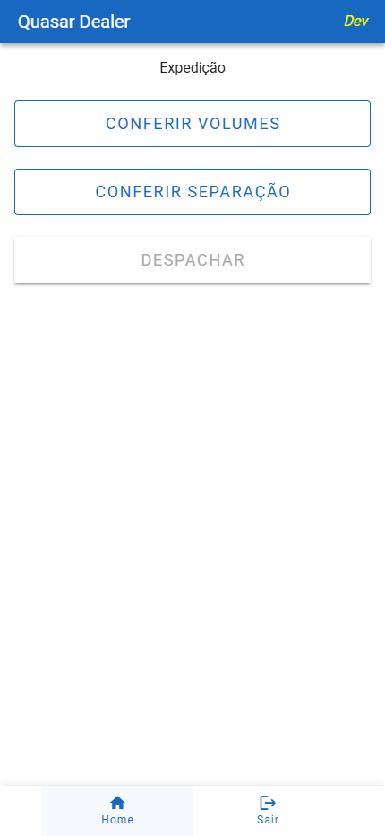
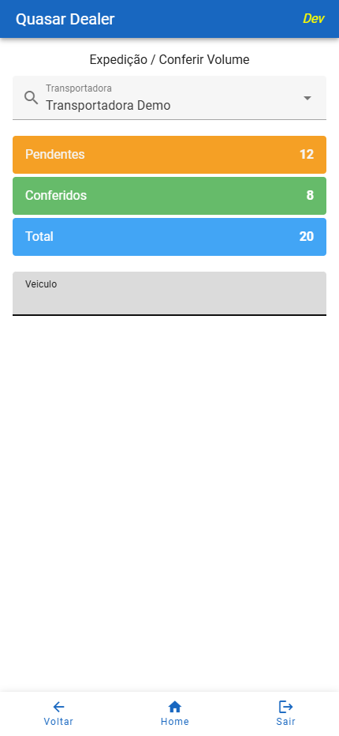
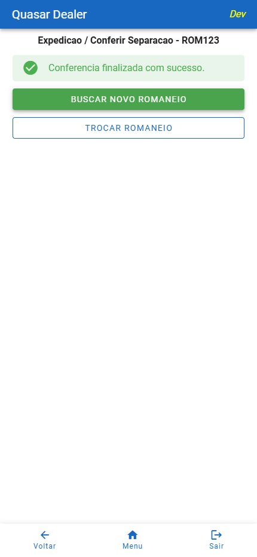
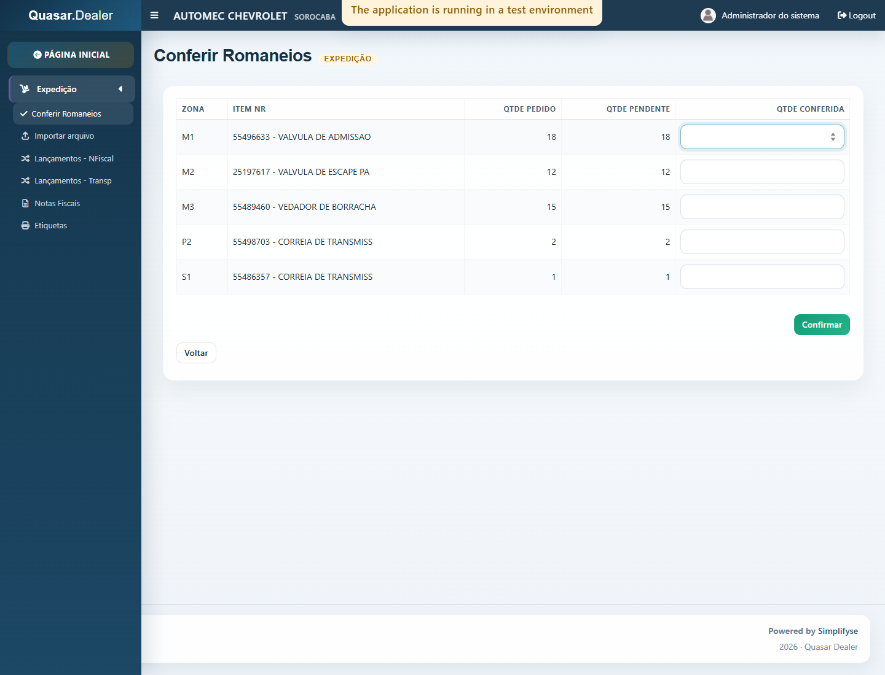
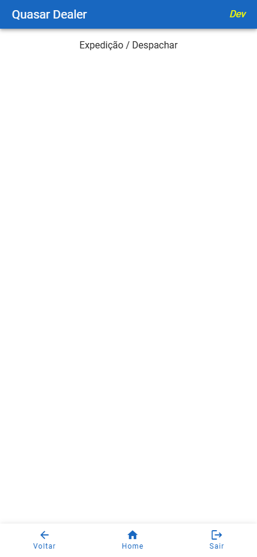

# Manual por Tela - Expedição

## Objetivo

Documentar as telas do módulo `Expedicao` com foco em uso operacional, explicando:

- como acessar a tela
- qual a finalidade
- quais campos existem
- o que preencher em cada campo
- o que cada botão faz
- quais validações e mensagens podem ocorrer

## Como Usar Este Documento

Cada tela está organizada com o mesmo padrão:

1. objetivo
2. acesso
3. elementos visuais principais
4. campos e o que fazer em cada um
5. botões e ações
6. fluxo recomendado
7. validações e mensagens

## Política de Capturas

Este manual foi preparado para suportar capturas de tela reais.

Pasta sugerida para evidências:

- `web/docs/assets/manual-expedicao/`

Padrão sugerido de nomes:

- `01-menu-expedicao.png`
- `02-conferir-volume.png`
- `03-conferir-separacao-coletor.png`
- `04-conferir-romaneios-web.png`
- `05-despachar.png`
- `06-importar-transportadora.png`
- `07-imprimir-etiquetas.png`
- `08-clientes.png`

Enquanto as capturas não forem anexadas, este documento continua útil como manual funcional campo a campo.

---

## Tela 01. Menu Expedição no Coletor

### Captura Sugerida

### Objetivo

Servir como ponto de entrada para os fluxos operacionais de expedição no coletor.

### Acesso

1. Entrar no coletor.
2. Acessar o menu principal.
3. Selecionar `Expedicao`.

### Itens da Tela

| Elemento | Tipo | O que é | O que fazer |
|---|---|---|---|
| `Conferir Volumes` | Botão | Abre a tela de conferência de volumes | Tocar para iniciar a conferência de volumes |
| `Conferir Separacao` | Botão | Abre a tela de conferência de romaneios | Tocar para iniciar a conferência de romaneios |
| `Despachar` | Botão | Acesso previsto para fluxo de despacho | Usar quando o fluxo estiver habilitado para operação |
| `Home` | Botão inferior | Retorna ao menu principal | Usar para sair do módulo |
| `Sair` | Botão inferior | Encerra a sessao | Usar ao finalizar a operação |

### Observações

- a tela não exige preenchimento de campos
- ela funciona apenas como menu operacional

---

## Tela 02. Conferir Volume no Coletor

### Captura Sugerida

### Objetivo

Conferir volumes de expedição por transportadora, controlar pendentes, conferidos e total, e registrar o histórico de leitura.

### Acesso

1. Abrir `Expedicao`.
2. Selecionar `Conferir Volumes`.

### Estrutura da Tela

Blocos principais:

- seleção da transportadora
- resumo de volumes
- identificação do veículo
- identificação do responsável
- leitura do volume
- modais de pendentes e conferidos

### Campos

| Campo | Tipo | Obrigatório | O que representa | O que fazer |
|---|---|---|---|---|
| `Transportadora` | Lista/autocomplete | Sim | Define a transportadora que sera conferida | Selecionar a transportadora antes de seguir |
| `Veiculo` | Texto | Sim | Identificação do veículo de expedição | Informar o veículo e confirmar |
| `Responsavel` | Texto | Sim | Pessoa responsável pela operação | Informar o responsável e confirmar |
| `Volume Nr` | Texto | Sim | Código do volume a ser conferido | Ler ou digitar o volume e confirmar |
| `Filtrar...` em `Pendentes` | Texto | Não | Filtro da lista de pendentes | Digitar termo para localizar registros |
| `Filtrar...` em `Conferidos` | Texto | Não | Filtro da lista de conferidos | Digitar termo para localizar registros |

### Resumo Visual

| Indicador | Significado | O que fazer |
|---|---|---|
| `Pendentes` | Quantidade ainda não conferida | Pode tocar para abrir a lista detalhada |
| `Conferidos` | Quantidade já lida | Pode tocar para abrir a lista detalhada |
| `Total` | Total previsto para a transportadora | Usar como referência geral |

### Botões e Ações

| Botão | Ação |
|---|---|
| `Pendentes` | Abre modal com lista de documentos/volumes pendentes |
| `Conferidos` | Abre modal com lista de histórico lido |
| `Fechar` nos modais | Fecha a lista aberta |
| `Voltar` | Retorna ao menu de expedição |
| `Menu` / `Home` | Retorna ao menu principal |
| `Sair` | Encerra a sessao |

### Como Operar

1. Selecionar a `Transportadora`.
2. Conferir o resumo apresentado.
3. Informar o `Veiculo`.
4. Informar o `Responsavel`.
5. Ler ou digitar o `Volume Nr`.
6. Repetir a leitura até concluir os volumes.

### Regras e Validações

| Situação | Comportamento esperado |
|---|---|
| Nenhuma transportadora selecionada | O sistema bloqueia a continuidade e solicita seleção |
| Falha ao carregar transportadoras | Exibe popup de erro |
| Falha ao obter pendentes ou conferidos | Exibe popup de erro |
| Volume fora do formato esperado | O volume não é aceito |
| Volume já registrado para a NF | O sistema informa duplicidade |
| Nota fiscal sem volume esperado | O sistema informa a divergência |
| Todos os volumes da nota já registrados | O sistema informa que a nota já está completa |

### Campos Exibidos nos Modais

#### Modal Pendentes

| Coluna | Significado |
|---|---|
| `NF` | Número da nota fiscal |
| `Ctrl` | Controle do documento |
| `Vol` | Quantidade de volumes |
| `Cliente` | Nome do cliente |
| `Cidade` | Cidade do cliente |
| `UF` | Estado |

#### Modal Conferidos

| Coluna | Significado |
|---|---|
| `NF` | Número da nota fiscal |
| `Vol` | Volume lido |
| `Veiculo` | Veículo utilizado |
| `Resp.` | Responsável informado |
| `Cliente` | Nome do cliente |
| `Cidade` | Cidade do cliente |
| `UF` | Estado |
| `Data` | Data/hora do registro |
| `Usuario` | Usuário que registrou |

---

## Tela 03. Conferir Separação no Coletor

### Captura Sugerida

### Objetivo

Conferir itens de um romaneio de expedição no coletor, com bloqueio por usuário e controle de quantidades.

### Acesso

1. Abrir `Expedicao`.
2. Selecionar `Conferir Separacao`.

### Estrutura da Tela

Blocos principais:

- seleção do romaneio
- item atual em conferência
- resumo do item atual
- campo de quantidade
- tabela de apoio com itens do romaneio
- botões de navegação

### Campos

| Campo | Tipo | Obrigatório | O que representa | O que fazer |
|---|---|---|---|---|
| `Romaneio Nr` | Lista/autocomplete | Sim | Romaneio disponível para conferência | Selecionar o romaneio. A conferência inicia automaticamente |
| `Quantidade conferida` | Número | Sim, para confirmar o item atual | Quantidade a ser conferida do item atual | Informar a quantidade e confirmar |

### Informações Exibidas do Item Atual

| Campo exibido | Significado |
|---|---|
| `Zona` | Zona operacional do item |
| `Item Nr` | Código do item atual |
| `Descricao` | Descrição do item |
| `Pedido` | Quantidade pedida |
| `Conferida` | Quantidade já conferida |
| `Faltante` | Quantidade ainda pendente |

### Botões e Ações

| Botão | Ação |
|---|---|
| `Confirmar` | Confirma a quantidade do item atual |
| `Buscar novo romaneio` | Reinicia a busca quando a conferência termina |
| `Trocar romaneio` | Limpa o contexto atual para nova seleção |
| `Voltar` | Sai da tela e libera o romaneio se ainda estiver em andamento |
| `Menu` | Retorna ao menu principal |
| `Sair` | Encerra a sessao, liberando o romaneio se necessário |
| `Fechar` no popup | Fecha mensagens de erro ou informação |
| `Sim/Não` no popup de zero | Confirma ou cancela o envio do item para busca |

### Como Operar

1. Selecionar o `Romaneio Nr`.
2. Aguardar o inicio automático da conferência.
3. Verificar o item atual.
4. Informar a `Quantidade conferida`.
5. Confirmar.
6. Repetir até concluir o romaneio.

### Regras e Validações

| Situação | Comportamento esperado |
|---|---|
| Romaneio assumido por outro usuário | Bloqueio de acesso |
| Quantidade maior que a faltante | Rejeicao da confirmação |
| Quantidade menor que a pendente | Item continua em conferência |
| Quantidade igual ao restante | Item finaliza |
| Quantidade zero | Sistema pede confirmação e envia o item para `Em Busca` se confirmado |
| Sair com romaneio em andamento | O sistema tenta liberar o romaneio |

### Tabela de Apoio

| Coluna | Significado |
|---|---|
| `Zona` | Zona do item |
| `Item` | Código do item |
| `Ped` | Quantidade pedida |
| `Conf` | Quantidade conferida |
| `Falta` | Quantidade pendente |

---

## Tela 04. Conferir Romaneios no Web

### Captura Sugerida

### Objetivo

Executar no web o mesmo processo operacional de conferência de romaneios de expedição, com digitação por linha e confirmação em lote.

### Acesso

1. Entrar no sistema web.
2. Acessar `Expedicao`.
3. Selecionar `Conferir Romaneios`.

### Estrutura da Tela

Blocos principais:

- seletor de romaneio
- grade de itens
- botões de ação
- alertas de erro e sucesso

### Campos

| Campo | Tipo | Obrigatório | O que representa | O que fazer |
|---|---|---|---|---|
| `Romaneio Nr` | Lista | Sim | Romaneio disponível para conferência | Selecionar o romaneio. A conferência inicia automaticamente |
| `Qtde Conferida` por linha | Número | Sim para a linha que sera confirmada | Quantidade conferida para o item da linha | Preencher as linhas desejadas antes de clicar em `Confirmar` |

### Colunas da Grade

| Coluna | Significado | O que observar |
|---|---|---|
| `Zona` | Zona do item | Usar para localizar o contexto operacional |
| `Item Nr` | Item e descrição na mesma célula | Identifica o item a ser conferido |
| `Qtde Pedido` | Quantidade total pedida | Referência original |
| `Qtde Pendente` | Quantidade faltante | Limite máximo do que ainda pode ser confirmado |
| `Qtde Conferida` | Campo de digitação da quantidade | Informar o valor a confirmar |

### Botões e Ações

| Botão | Ação |
|---|---|
| `Confirmar` | Envia as quantidades digitadas |
| `Buscar novo romaneio` | Reinicia a conferência após finalização |
| `Trocar romaneio` | Limpa a seleção atual |
| `Voltar` | Sai da tela e libera o romaneio se estiver em andamento |

### Como Operar

1. Selecionar o `Romaneio Nr`.
2. Aguardar a carga automática dos itens.
3. Digitar a `Qtde Conferida` nas linhas desejadas.
4. Clicar em `Confirmar`.
5. Repetir até concluir o romaneio.

### Regras e Validações

| Situação | Comportamento esperado |
|---|---|
| Seleção de romaneio | Inicia a conferência automaticamente |
| Digitar valor em uma linha | O sistema registra interacao para marcar o tempo operacional |
| Nenhuma quantidade informada | O sistema bloqueia a confirmação |
| Quantidade invalida ou negativa | O sistema rejeita a confirmação |
| Quantidade maior que a pendente | O sistema mostra popup de erro |
| Quantidade zero em alguma linha | O sistema pede confirmação antes de gravar |
| Romaneio em uso por outro usuário | O sistema bloqueia o acesso |
| Romaneio finalizado | Mostra mensagem de sucesso e botões de continuidade |

---

## Tela 05. Despachar no Coletor

### Captura Sugerida

### Objetivo

Servir como base para o fluxo de despacho no coletor.

### Situação Atual Observada

A tela possui:

- título
- navegação inferior
- diálogo de mensagens
- diálogo de saida
- estrutura inicial para reportar ocorrencia

### Elementos Visíveis

| Elemento | Tipo | O que fazer |
|---|---|---|
| `Voltar` | Botão | Retorna ao menu de expedição |
| `Menu` | Botão | Retorna ao menu principal |
| `Sair` | Botão | Encerra a sessao |
| `Reportar Ocorrencia` | Diálogo/base funcional | Preencher quando o fluxo for oficialmente habilitado |

### Observação

- a tela parece estar em estado inicial ou parcial
- antes de virar documento oficial de treinamento, convém validar com a operação se o fluxo já está homologado para uso

---

## Tela 06. Importar Arquivo de Transportadora no Web

### Objetivo

Processar o PDF da transportadora, criar uma etiqueta por volume novo e imprimir conforme os parâmetros da filial.

### Campos e Informações

| Campo | Origem/uso |
|---|---|
| `Transportadora` | Define o cadastro e o layout operacional do lote |
| `Tipo de Movimento` | Define o movimento dos documentos novos |
| `Arquivo` | PDF fornecido pela transportadora |
| `Imprimir` | Permite marcar ou desmarcar individualmente cada etiqueta |
| `Volume Nr` | Identifica o volume que será impresso |
| Grade | Mostra somente as últimas etiquetas processadas da filial |

### Como Operar

1. Selecione a transportadora.
2. Selecione o PDF fornecido pela transportadora.
3. Clique em `Importar`. A importação começa diretamente, sem popup de confirmação.
4. No modo manual, revise a grade e use `Marcar Todos`, `Desmarcar Todos` ou os marcadores individuais.
5. Clique em `Imprimir selecionadas`.
6. Confira o preview e escolha a impressora no diálogo do Windows.

### Regras e Validações

- NFs existentes em `DocExpedicao` não são gravadas nem etiquetadas novamente.
- Linhas duplicadas no PDF não duplicam volumes.
- Um upload válido substitui o lote anterior; a tabela não é acumulativa.
- No modo manual, todas as etiquetas começam marcadas e somente as selecionadas são impressas.
- `ImprimirDireto = True` mantém o processo automático configurado para a filial.
- `ImprimirDireto = False` abre o preview das etiquetas e o diálogo de impressão do Windows.
- Cliente identificado com todos os cadastros homônimos em `Etiqueta = 0` ou `NULL` não gera etiqueta.
- Se pelo menos um cliente homônimo estiver com `Etiqueta = 1`, a etiqueta é gerada.
- Quando não for possível identificar o cliente com segurança, o sistema considera `Etiqueta = 1`.
- Sem etiquetas, o sistema informa `Nenhuma etiqueta foi gerada.`
- A grade mantém o último lote tanto no fluxo automático quanto no manual.

### Parâmetros

- `AppConfig`: `ImprimirDireto`, `ImpressoraPadrao`, `PrinterServerIP`, `PrinterServerPort`.
- `Impressora`: nome, IP e porta TCP.
- Não existem valores alternativos fixos no código.

---

## Tela 07. Imprimir Etiquetas no Web

### Objetivo

Reimprimir um intervalo de volumes de uma nota fiscal utilizando preview e escolha manual da impressora.

### Campos

| Campo | O que fazer |
|---|---|
| `DANFE` | Ler ou digitar a chave de 44 posições ou o número da nota fiscal |
| `Transportadora` | Campo preenchido automaticamente após localizar a nota |
| `Volumes` | Informar o primeiro e o último volume que serão impressos |

### Como Operar

1. Leia a chave DANFE ou informe o número da nota fiscal.
2. Confira a transportadora e a quantidade máxima de volumes preenchidas pelo sistema.
3. Informe o intervalo de volumes.
4. Clique em `Imprimir`.
5. Confira o preview e escolha a impressora no diálogo do Windows.

### Regras e Validações

- A impressão segue diretamente para o preview, sem popup adicional de confirmação.
- O intervalo deve começar em `1` ou mais e não pode ultrapassar a quantidade cadastrada.
- A nota deve estar em situação permitida para impressão.
- A transportadora deve estar configurada para emitir etiqueta.
- Cliente identificado com `Etiqueta = 0` ou `NULL` não permite impressão.
- Em caso de clientes homônimos, qualquer cadastro com `Etiqueta = 1` autoriza a impressão; se todos estiverem em `0` ou `NULL`, a impressão é bloqueada.
- Na dúvida ou quando o cliente não for localizado, o sistema considera `Etiqueta = 1`.

---

## Tela 08. Clientes no Web

### Objetivo

Cadastrar clientes e definir se suas notas fiscais podem gerar etiquetas de expedição.

### Campos Principais

| Campo | Regra |
|---|---|
| `Nome` | Identificação obrigatória do cliente |
| `CPF/CNPJ` | Opcional; quando informado, deve ser um CPF ou CNPJ válido e não duplicado |
| `Transportadora` | A lista mostra nome, cidade e CNPJ para diferenciar transportadoras homônimas |
| `Rota` e `Parada` | Dados utilizados no processo de expedição |
| `Gerar etiqueta` | Marcado por padrão em novos clientes; pode ser marcado ou desmarcado |

### Regras e Validações

- `Gerar etiqueta` marcado grava `Cliente.Etiqueta = 1`.
- `Gerar etiqueta` desmarcado grava `Cliente.Etiqueta = 0`.
- Cadastros antigos com valor `NULL` são tratados como não autorizados quando o cliente é identificado sem dúvida.
- A grade permite pesquisa, ordenação e paginação no servidor.
- O CPF/CNPJ vazio é salvo como `NULL`.

---

## Checklist para Anexar Capturas Reais

Quando quiser evoluir este manual com evidências visuais, use o checklist abaixo:

1. Abrir a tela no ambiente homologado.
2. Capturar a tela cheia.
3. Salvar a imagem em `web/docs/assets/manual-expedicao/`.
4. Nomear conforme o padrão definido neste documento.
5. Anotar versão/data da captura.
6. Atualizar este arquivo com o link da imagem.

## Próximos Passos Recomendados

Depois de `Expedicao`, os próximos manuais por tela mais valiosos são:

1. `Separacao`
2. `Recebimento`
3. `Estoque`
