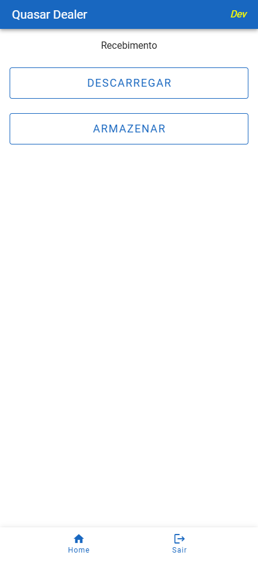
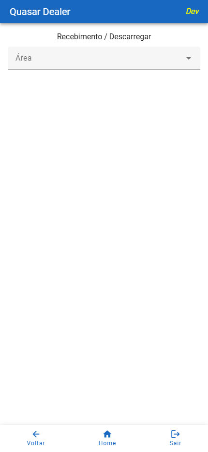
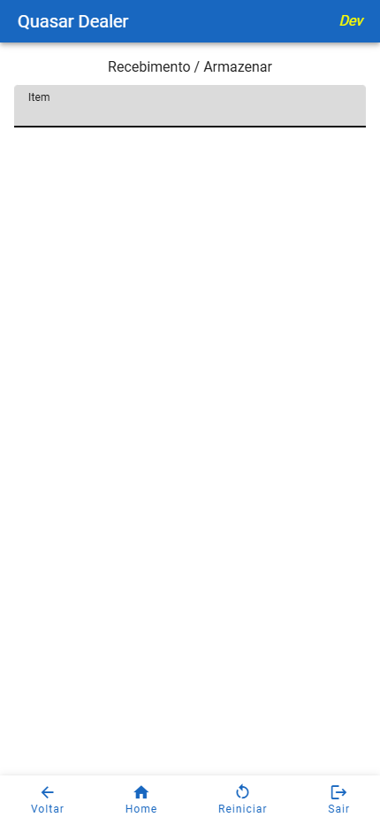
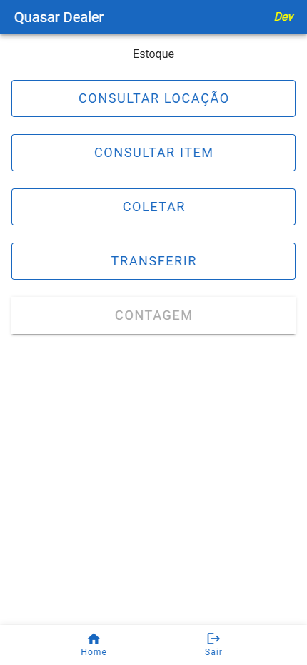
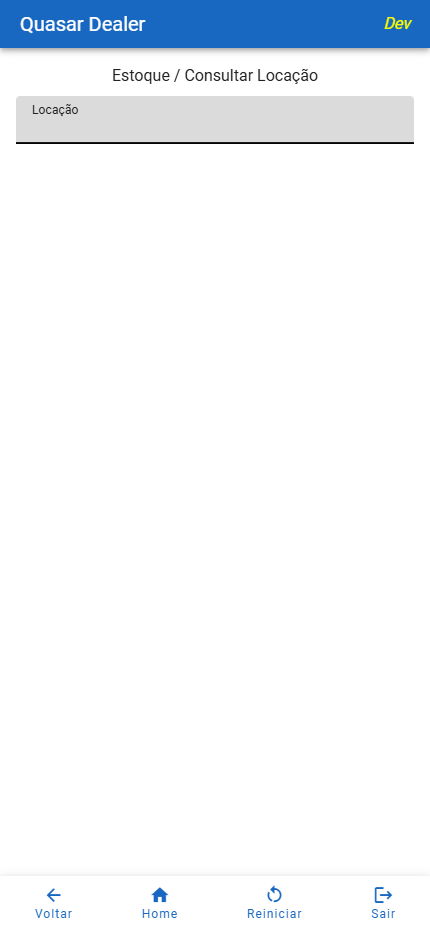
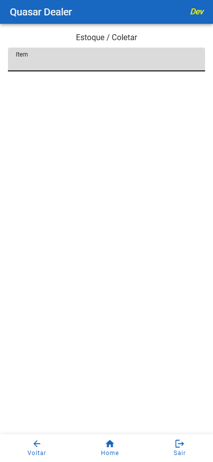
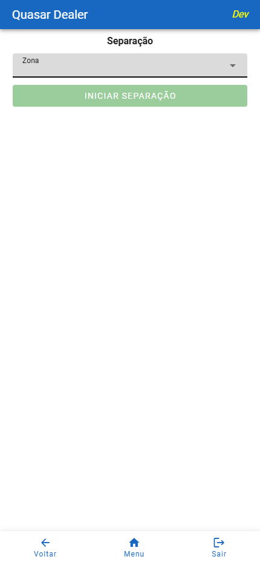
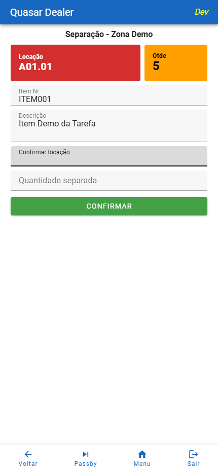

# Catálogo de Telas

## Objetivo

Centralizar a consulta visual das principais telas operacionais do WMS Quasar no contexto Automec.

Este documento funciona como indice rápido para:

- localizar a tela por módulo
- visualizar a captura correspondente
- acessar o manual detalhado de cada módulo

## Como Usar

1. Localize o módulo desejado.
2. Identifique a tela pela miniatura e pelo objetivo.
3. Abra o manual detalhado do módulo para ver campos, botões, regras e fluxo operacional.

## Recebimento

Manual detalhado: [MANUAL_TELAS_RECEBIMENTO.md](MANUAL_TELAS_RECEBIMENTO.md)

### Menu Recebimento

Objetivo: entrada principal do fluxo operacional de recebimento no coletor.

### Descarregar

Objetivo: registrar a descarga inicial dos volumes e documentos recebidos.

Recursos atuais: card `Pendentes` com lista de `VolumeNr` e teclado virtual habilitado somente pelo ícone.

### Armazenar

Objetivo: direcionar itens recebidos para locações de armazenagem.

### Conferir Recebimento

Objetivo: validar o recebimento físico por item, registrar quantidades e confirmar divergências.

### Conferência de Volumes no Web

Objetivo: pesquisar um volume, informar a quantidade conferida e finalizar cada item pelo botão `Confirmar`.

### Consulta por Volume Nr no Web

Objetivo: consultar quantidade faturada, conferida, armazenada, divergência, responsáveis e status do volume.

## Estoque

Manual detalhado: [MANUAL_TELAS_ESTOQUE.md](MANUAL_TELAS_ESTOQUE.md)

### Menu Estoque

Objetivo: entrada principal do módulo de estoque no coletor.

### Consultar Locação

Objetivo: consultar dados de uma locação física no armazem.

### Consultar Item

Objetivo: consultar informações de um item específico.

### Coletar

Objetivo: registrar coleta ou retirada operacional de materiais.

### Transferir

Objetivo: movimentar material entre locações.

### Contar

Objetivo: executar contagem de estoque.

## Separação

Manual detalhado: [MANUAL_TELAS_SEPARAÇÃO.md](MANUAL_TELAS_SEPARACAO.md)

### Selecionar Zona

Objetivo: iniciar uma tarefa de separação por zona operacional.

### Linha Atual

Objetivo: orientar o operador na linha corrente da tarefa.

### Separação Finalizada

Objetivo: indicar conclusão do fluxo de separação no coletor.

## Expedição

Manual detalhado: [MANUAL_TELAS_EXPEDIÇÃO.md](MANUAL_TELAS_EXPEDICAO.md)

### Menu Expedição

Objetivo: entrada principal do módulo de expedição no coletor.

### Conferir Volume

Objetivo: conferir volumes por transportadora e acompanhar pendentes e conferidos.

### Conferir Separação no Coletor

Objetivo: conferir romaneios no coletor com bloqueio por usuário e controle de quantidades.

### Conferir Romaneios no Web

Objetivo: conferir romaneios na aplicação web com lançamento por linha e confirmação em lote.

### Despachar

Objetivo: apoiar a etapa operacional de despacho na expedição.

### Importar Arquivo de Transportadora no Web

Objetivo: importar o PDF, gerar uma etiqueta por volume novo, imprimir conforme `ImprimirDireto` e manter somente o último lote na grade.

## Anomalias

### Cadastrar Anomalia

Pesquisa o número do item, lista as NFs e volumes elegíveis, calcula prazo e saldo e permite adicionar cada reclamação ao processo.

### Consultar Anomalias

Filtra processos por controle, tipo e status e permite abrir o detalhamento.

### Detalhes do Processo

Permite aceitar ou rejeitar itens e exportar o formulário oficial GM ou o formulário de Danificados.

Consulte [Manual por Tela - Anomalias](MANUAL_TELAS_ANOMALIAS.md).

## Devolução

### Cadastrar Devolução

Registra dados do processo, localiza a NF de venda e inclui os itens devolvidos.

### Consultar Processos

Lista processos, abre os detalhes, permite atualização, impressão e exclusão confirmada.

### Ocorrências

Permite tratar status, quantidade e observação de cada item da ocorrência.

Consulte [Manual por Tela - Devolução](MANUAL_TELAS_DEVOLUCAO.md).

## Cadastros e Administração

Relaciona filiais, parâmetros, áreas, equipamentos, materiais, impressoras, usuários, perfis, funções e cadastros auxiliares.

Consulte [Manual por Tela - Cadastros e Administração](MANUAL_TELAS_CADASTROS.md).

## Observações Gerais

- as capturas refletem o ambiente local de documentação e servem como referência visual de uso
- os manuais detalhados continuam sendo a fonte principal para regras, validações e passos operacionais
- as regras entregues em 20/07/2026 estão consolidadas em [ATUALIZAÇÕES_20260720.md](ATUALIZACOES_20260720.md)
- as regras entregues em 25/08/2026 estão consolidadas em [ATUALIZAÇÕES_20260825.md](ATUALIZACOES_20260825.md)
